# Đếm Phương Tiện Giao Thông Bằng YOLOv8 & ByteTrack
> Đồ án môn học: Cơ sở & Ứng dụng Trí tuệ Nhân tạo (CS & UD AI)

<p align="center">
  
</p>

---

## 👥 Thành viên thực hiện
* **Giáo viên hướng dẫn:** PGS.TS Trương Ngọc Sơn
* **Sinh viên thực hiện (Nhóm 32):**
  1. Nguyễn Hoàng Sơn — MSSV: 23119102
  2. Đặng Thị Khánh Huyền — MSSV: 23119066
  3. Nguyễn Thành Trung — MSSV: 23119117

---

## 📌 Tổng quan dự án
Dự án tập trung vào việc phát triển hệ thống phát hiện, theo dõi (tracking) và đếm số lượng phương tiện giao thông theo thời gian thực từ video/camera giám sát. Hệ thống sử dụng:
* **YOLOv8n (Ultralytics):** Nhận diện các lớp phương tiện (`Car`, `Motorcycle`, `Bus`, `Truck`) với kích thước nhỏ gọn, tối ưu cho thiết bị Edge AI.
* **ByteTrack:** Duy trì ID đối tượng qua các frame liên tiếp để tránh đếm trùng và xử lý trường hợp bị che khuất.
* **Virtual Counting Line (Vạch đếm ảo):** Xác định thời điểm xe đi qua vạch để cập nhật thống kê.
* **Region of Interest (ROI):** Lọc bỏ các xe ở quá xa camera để giảm nhiễu phát hiện sai.
* **Quantization (Lượng tử hóa):** Đưa mô hình từ PyTorch (FP32) sang định dạng ONNX (FP16) để tăng tốc độ suy luận.

### 📐 Sơ đồ kiến trúc YOLOv8
<p align="center">
  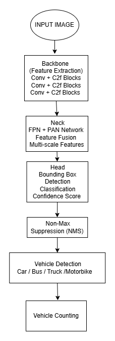
  <br><i>Hình 1: Sơ đồ kiến trúc YOLOv8</i>
</p>

---

## 🏗️ Thiết kế hệ thống

### 1. Sơ đồ khối tổng thể
Hệ thống tích hợp video đầu vào và mô hình đã được huấn luyện, xử lý qua thuật toán tracking ByteTrack trước khi đưa vào bộ logic đếm xe qua vạch ảo:
<p align="center">
  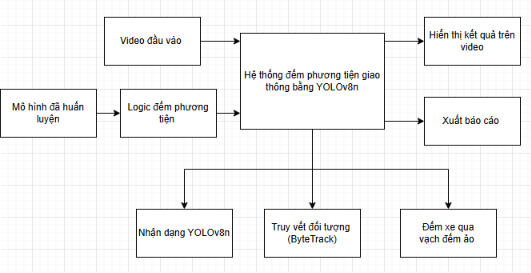
  <br><i>Hình 2: Sơ đồ khối tổng thể hệ thống đếm phương tiện bằng YOLOv8n</i>
</p>

### 2. Sơ đồ luồng dữ liệu (Data Flow)
Luồng dữ liệu chi tiết của hệ thống từ khung hình gốc tới xử lý AI, ByteTrack và hiển thị kết quả lên video output:
<p align="center">
  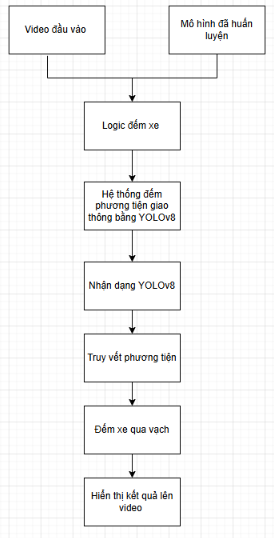
  <br><i>Hình 3: Sơ đồ luồng dữ liệu của hệ thống đếm phương tiện giao thông bằng YOLOv8</i>
</p>

---

## 📁 Cấu trúc thư mục dự án
```
Finalllllllllllllllllllllll/
│
├── train.py               # Script huấn luyện YOLOv8n trên Kaggle (Online Augmentation)
├── export.py              # Script xuất/lượng tử hóa model sang ONNX (FP16)
├── detect_and_count.py    # Script chạy logic nhận diện, tracking và đếm xe qua vạch ảo
│
├── dataset.yaml           # File cấu hình dữ liệu thủ công
├── dataset_auto.yaml      # File cấu hình dữ liệu sinh ra tự động khi train trên Kaggle
├── yolov8n.pt             # Trọng số YOLOv8n gốc pre-trained
│
├── assets/                # Chứa hình ảnh minh họa cho báo cáo và README
└── runs/                  # Thư mục chứa kết quả huấn luyện (đồ thị, confusion matrix, weights)
```

---

## 🛠️ Hướng dẫn cài đặt

### Yêu cầu hệ thống
* Python 3.8+
* GPU hỗ trợ CUDA (khuyên dùng để đạt hiệu năng tối ưu)

### Cài đặt thư viện phụ thuộc
Mở CMD/Terminal và chạy lệnh sau:
<p align="center">
  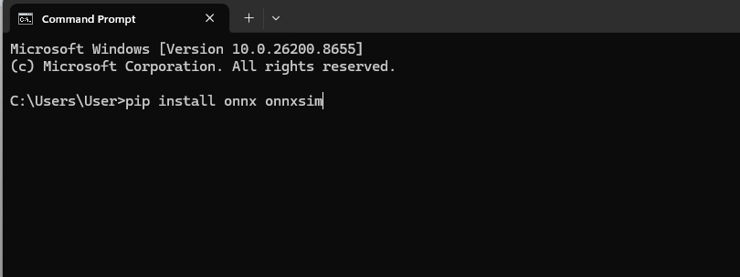
  <br><i>Hình 13: Cài đặt thư viện onnx trên CMD</i>
</p>

```bash
pip install ultralytics opencv-python onnx onnxsim pyyaml
```

---

## 🚀 Hướng dẫn chạy chương trình

### 1. Huấn luyện mô hình (`train.py`)
File `train.py` chạy trên Kaggle Notebook với GPU. Script tự động tìm đường dẫn dataset, tạo file `.yaml` và huấn luyện với **Online Augmentation**:
```bash
python train.py
```
*Các tham số tăng cường dữ liệu được sử dụng: Mosaic (1.0), Scale (0.5), Translate (0.1), Fliplr (0.5), HSV color adjustment.*

<p align="center">
  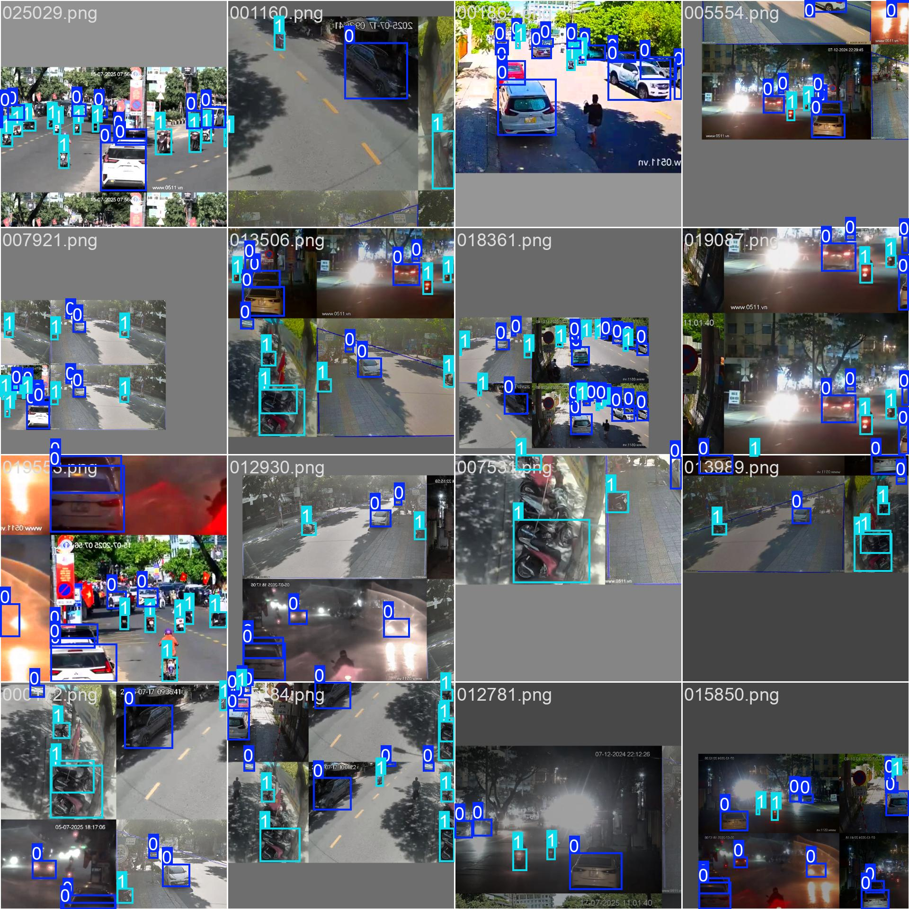
  <br><i>Hình 4: Hình ảnh dữ liệu được tạo nhiễu và tăng cường online trong quá trình huấn luyện</i>
</p>

### 2. Lượng tử hóa mô hình (`export.py`)
Chạy script để chuyển đổi trọng số từ `.pt` sang `.onnx` ở mức chính xác nửa thực (FP16) giúp tối ưu hiệu năng:
```bash
python export.py
```
Sau khi huấn luyện thành công, cấu trúc thư mục đầu ra sẽ có dạng:
<p align="center">
  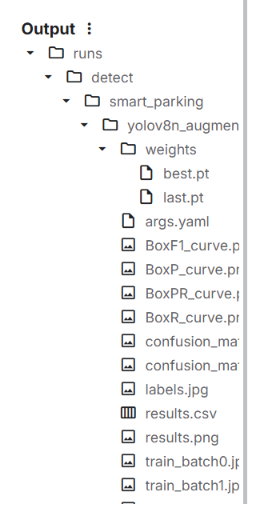
  <br><i>Hình 12: Cấu trúc tập tin Output sau khi train</i>
</p>

### 3. Triển khai logic đếm xe (`detect_and_count.py`)
Đọc luồng video, áp dụng tracking ByteTrack và đếm xe qua vạch ảo:
```bash
python detect_and_count.py
```

#### Minh họa quá trình tracking và phát hiện:
* **Theo dõi đa đối tượng với ByteTrack:**
  <p align="center">
    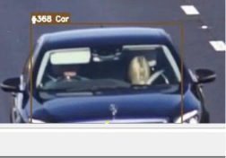
    <br><i>Hình 14: Hình ảnh minh họa về gán ID theo dõi bằng ByteTrack</i>
  </p>

* **Vẽ Bounding Box phương tiện:**
  <p align="center">
    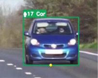
    <br><i>Hình 15: Hình ảnh minh họa vẽ Bounding box và nhãn phương tiện</i>
  </p>

* **Vạch đếm ảo ảo (Virtual Line) & Vùng ROI:**
  <p align="center">
    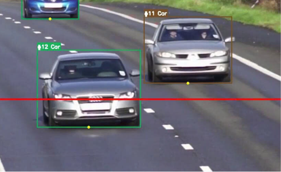
    <br><i>Hình 16: Hình ảnh minh họa cho vạch đếm ảo màu đỏ (sẽ nhảy xanh khi có xe đi qua)</i>
  </p>

---

## 📊 Kết quả huấn luyện & Đánh giá hiệu năng

### 1. Đồ thị quá trình học tập (Loss Curves)
Các giá trị loss (box, cls, dfl) giảm dần ổn định trên cả tập Train và Validation qua các Epochs:
<p align="center">
  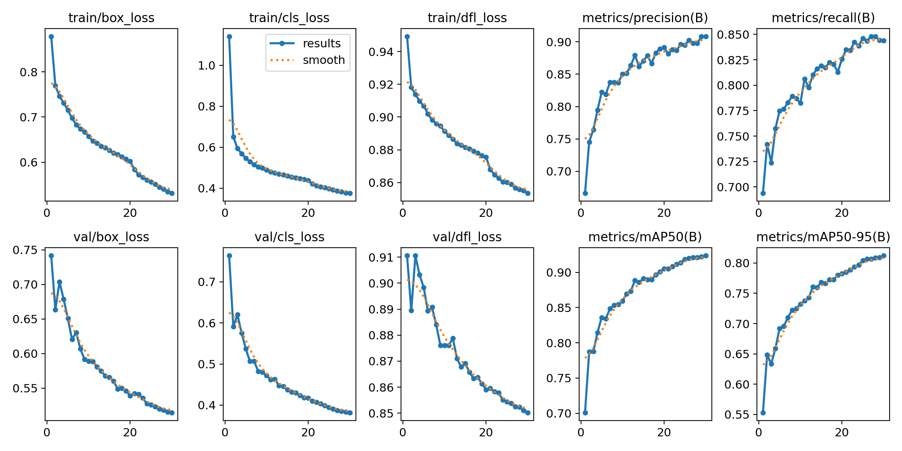
  <br><i>Hình 5: Biểu đồ loss và các chỉ số đánh giá trong quá trình huấn luyện</i>
</p>

### 2. Các đường cong đánh giá (Curves)
<table align="center">
  <tr>
    <td>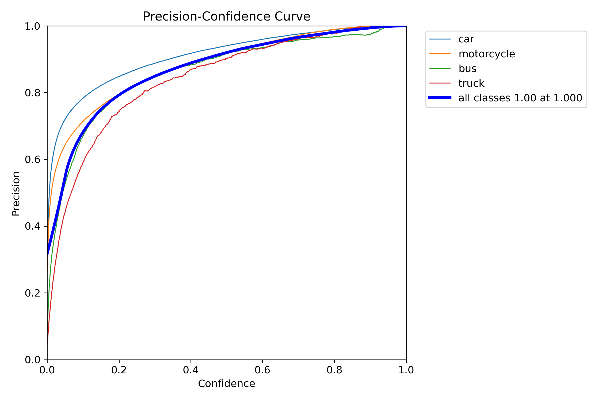<br><center><i>Hình 6: Precision–Confidence Curve</i></center></td>
    <td>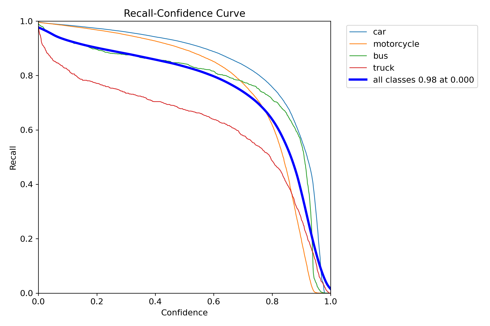<br><center><i>Hình 7: Recall–Confidence Curve</i></center></td>
  </tr>
  <tr>
    <td>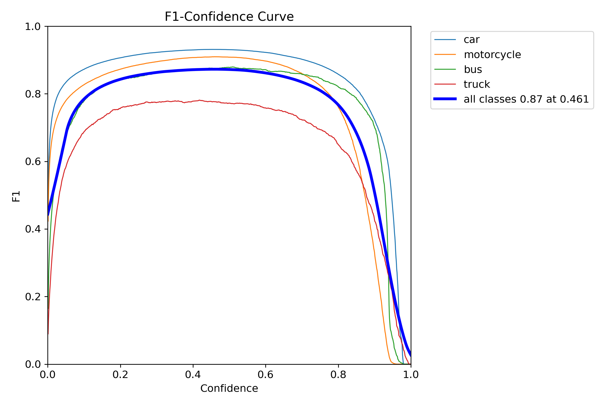<br><center><i>Hình 8: F1–Confidence curve</i></center></td>
    <td>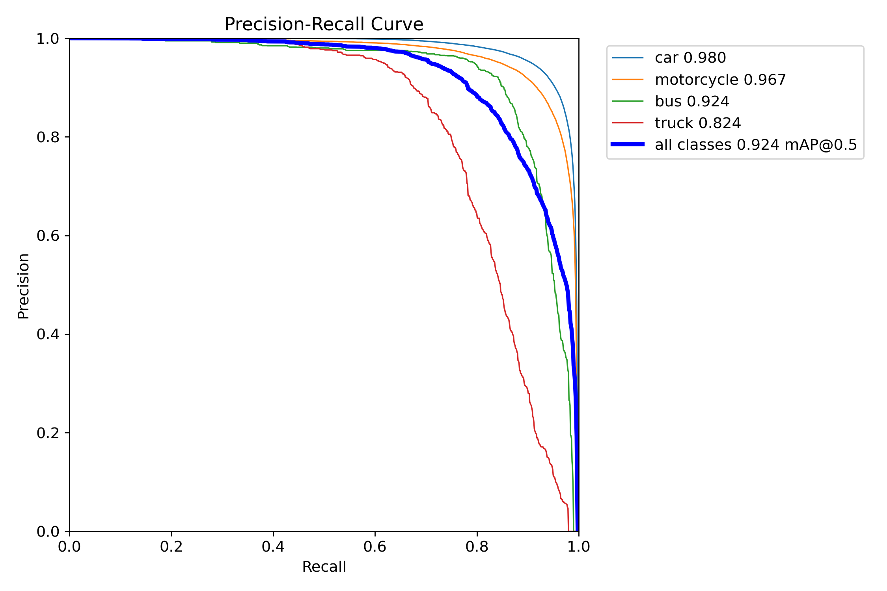<br><center><i>Hình 9: Precision–Recall curve</i></center></td>
  </tr>
</table>

### 3. Ma trận nhầm lẫn (Confusion Matrix)
Ma trận nhầm lẫn cho thấy khả năng phân loại cực tốt của mô hình ở các lớp `Car` (97%) và `Motorcycle` (96%), trong khi `Bus` (86%) và `Truck` (71%) có phần thấp hơn do đặc trưng mẫu ảnh:
<table align="center">
  <tr>
    <td>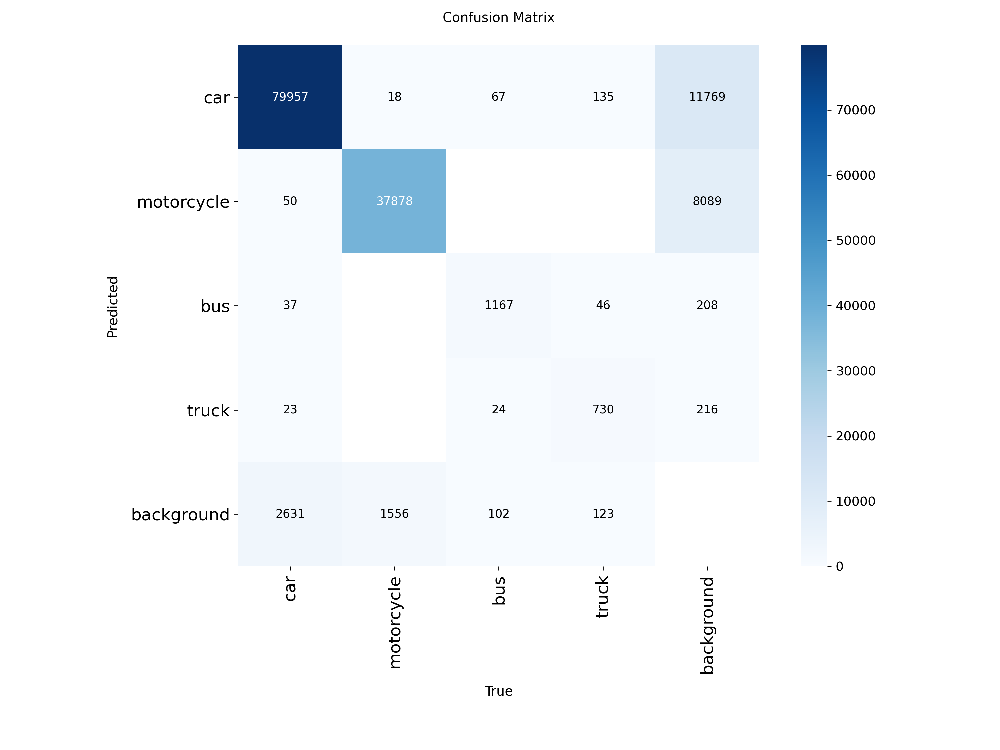<br><center><i>Hình 10: Confusion Matrix</i></center></td>
    <td>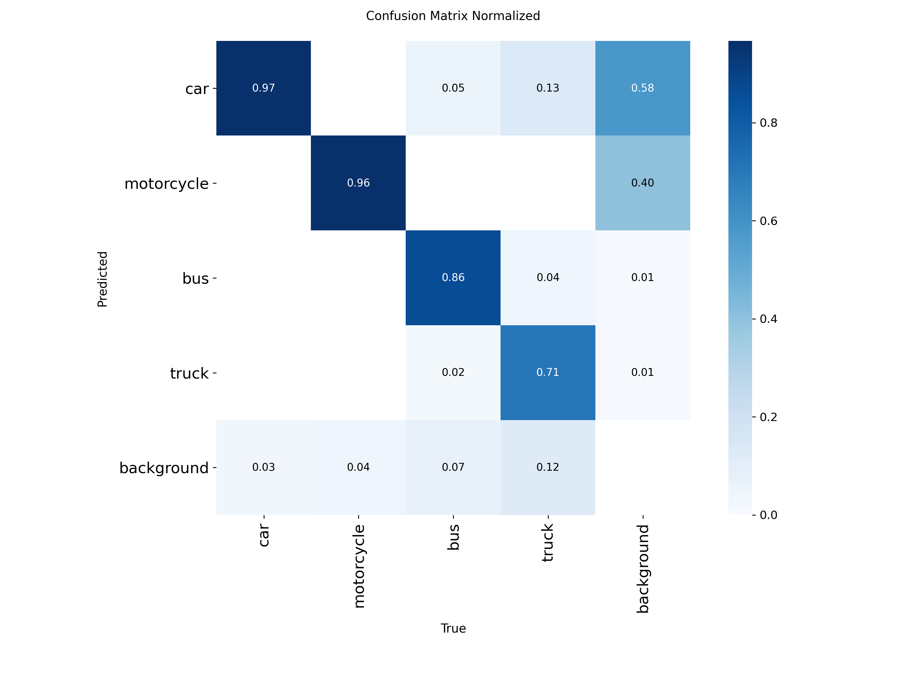<br><center><i>Hình 11: Confusion Matrix Normalized</i></center></td>
  </tr>
</table>

---

## 🎬 Kết quả đếm phương tiện thực tế

### Minh họa kết quả chạy thực nghiệm:
<p align="center">
  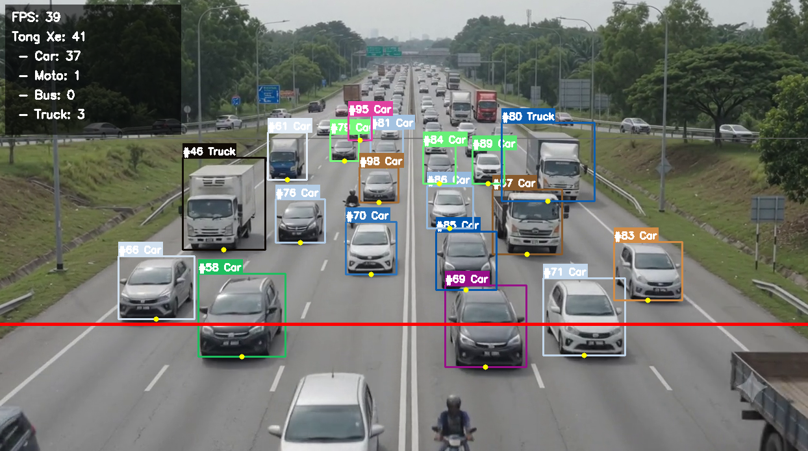
  <br><i>Hình 17: Hình ảnh kết quả khi kết hợp mô hình AI, tracking ID và logic đếm xe qua vạch ảo</i>
</p>

### So sánh hiệu năng Đếm phương tiện (FP32 vs FP16 ONNX)

| File Video | Định dạng Model | FPS | Xe máy | Ô tô | Xe buýt | Xe tải | Tổng |
| :--- | :--- | :--- | :--- | :--- | :--- | :--- | :--- |
| **video_test** | **FP32 (.pt)** | **37.73** | **4** | **41** | **0** | **3** | **48** |
| video_test | FP16 (.onnx) | 26.67 | 1 | 42 | 0 | 3 | 46 |
| **video_demo** | **FP32 (.pt)** | **27.09** | **4** | **91** | **0** | **4** | **99** |
| video_demo | FP16 (.onnx) | 22.46 | 4 | 89 | 0 | 4 | 97 |

> 💡 **Nhận xét:** Trong môi trường thử nghiệm hiện tại, mô hình PyTorch FP32 chạy trực tiếp bằng CUDA mang lại tốc độ (FPS) và độ chính xác tốt nhất. Lượng tử hóa sang ONNX FP16 giúp giảm đáng kể kích thước mô hình, thích nghi chạy trên các phần cứng Edge nhúng chuyên dụng (như NVIDIA Jetson Nano với TensorRT).
